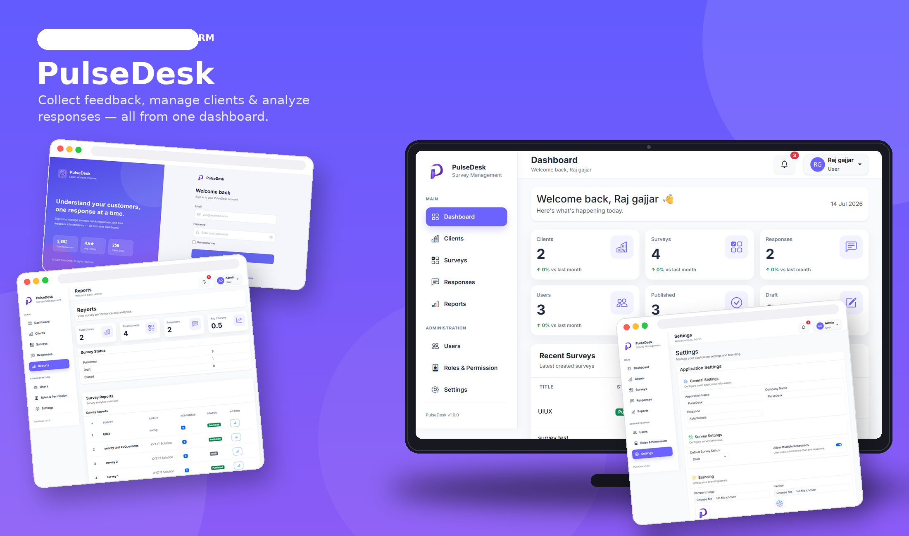

<div align="center">



# 🚀 PulseDesk

### Collect Feedback. Measure Satisfaction. Make Better Decisions.

A modern **SaaS-ready Survey & Feedback Management Platform** built with **Laravel 12**, designed to help businesses create professional surveys, collect meaningful customer feedback, analyze responses, and make data-driven decisions from a single dashboard.

<br>


</div>

---

# 📖 About PulseDesk

Customer feedback is one of the most valuable assets for any organization—but collecting responses alone isn't enough.

**PulseDesk** empowers businesses to create professional surveys, gather valuable customer feedback, organize responses, and transform raw data into meaningful insights through a modern and intuitive dashboard.

Whether you're measuring customer satisfaction, collecting employee feedback, conducting product research, or evaluating services, PulseDesk provides everything needed to manage the complete feedback lifecycle.

---

# 💡 Why PulseDesk?

Unlike traditional survey tools that only collect responses, PulseDesk helps you understand your audience through organized reporting, analytics, and centralized management.

With a clean interface, secure role-based access control, and scalable architecture, PulseDesk is designed for businesses, agencies, educational institutions, and organizations that rely on continuous feedback to improve products and services.

---

# ✨ Features

## 📋 Dynamic Survey Builder

Create beautiful and professional surveys within minutes.

Design unlimited surveys using multiple question types including Text, Textarea, Radio Buttons, Checkboxes, Dropdowns, and Rating Scales. Easily configure required questions, manage survey status, and publish whenever you're ready.

---

## 🌐 Public Survey Sharing

Collect responses without creating barriers.

Every published survey generates a unique public link that can be shared through email, websites, social media, or QR codes, allowing anyone to submit feedback without logging in.

---

## 📊 Intelligent Reports & Analytics

Turn feedback into actionable business insights.

Visualize response statistics through question-wise reports, option percentages, average ratings, response counts, and detailed survey analytics that help identify customer trends and improve decision-making.

---

## 📝 Response Management

Organize every submission in one centralized location.

Store, browse, review, and manage all survey responses with a clean interface, making it easy to analyze participant feedback whenever needed.

---

## 👥 Client Management

Perfect for businesses serving multiple clients.

Create dedicated client profiles and organize surveys separately for each organization, keeping customer feedback structured and easy to manage.

---

## 🔐 Enterprise Role & Permission System

Built with security and collaboration in mind.

Powered by **Spatie Laravel Permission**, PulseDesk implements a robust Role-Based Access Control (RBAC) system that ensures every user only accesses the features they are authorized to use.

---

## 👨‍💼 User Management

Manage your entire team effortlessly.

Create users, assign roles, activate or deactivate accounts, and securely manage access across the application through a centralized administration panel.

---

## ⚙️ Application Settings

Customize the platform without touching code.

Configure application name, company information, branding, logos, favicons, default survey behavior, timezone, and other system preferences directly from the settings panel.

---

## 🎨 Modern Responsive Dashboard

Designed for productivity on every device.

A clean Bootstrap 5 interface with reusable Blade components provides a consistent experience across desktop, tablet, and mobile devices.

---

## ⚡ Clean Laravel Architecture

Built using Laravel best practices.

PulseDesk follows a modular MVC architecture powered by Eloquent ORM, Resource Controllers, Form Requests, Blade Components, clean database relationships, and reusable UI components for long-term maintainability.

---

## 🔍 Powerful Search & Filtering

Quickly find exactly what you need.

Search, filter, and browse users, surveys, clients, and responses using fast search capabilities combined with pagination for handling large datasets efficiently.

---

## 🚀 SaaS Ready Foundation

Designed for future growth.

PulseDesk provides a scalable architecture that can easily be extended with features like Multi-Tenancy, REST APIs, Email Automation, AI-powered insights, Survey Scheduling, Payment Integration, and much more.

---

# 🏢 Perfect For

- Customer Satisfaction Surveys
- Employee Feedback Programs
- Product Reviews
- Market Research
- Event Feedback Collection
- Educational Institutions
- Internal Company Surveys
- Client Satisfaction Tracking
- HR Feedback Systems
- Agencies Managing Multiple Clients

---

# 🛠 Technology Stack

| Technology | Description |
|------------|-------------|
| Laravel 12 | Backend Framework |
| PHP 8.3 | Server-side Language |
| Bootstrap 5 | Responsive UI Framework |
| MySQL | Relational Database |
| Blade | Laravel Templating Engine |
| Eloquent ORM | Database ORM |
| Spatie Permission | Role & Permission Management |

---

# 🗄 Core Modules

- Dashboard
- Authentication
- Client Management
- Survey Builder
- Public Survey
- Response Management
- Reports & Analytics
- User Management
- Role & Permission Management
- Application Settings

---

# 📸 Application Preview


---

# ⚙️ Installation

Clone the repository

```bash
git clone https://github.com/Raj-Gajjar/pulsedesk.git
```

Move into the project

```bash
cd pulsedesk
```

Install dependencies

```bash
composer install
```

Create environment file

```bash
cp .env.example .env
```

Generate application key

```bash
php artisan key:generate
```

Configure your database inside `.env`

Run migrations

```bash
php artisan migrate
```

Seed the database

```bash
php artisan db:seed
```

Create storage link

```bash
php artisan storage:link
```

Start the application

```bash
php artisan serve
```

---

# 🔮 Roadmap

- Export to PDF
- Export to Excel
- Email Notifications
- Survey Scheduling
- REST API
- Multi-Tenant Support
- AI Feedback Summary
- Email Templates
- QR Code Sharing
- Charts & Advanced Analytics
- Dark Mode
- Multi-language Support

---

# 👨‍💻 Developer

**Raj Gajjar**

Laravel Developer

GitHub: https://github.com/Raj-Gajjar

Repository: https://github.com/Raj-Gajjar/pulsedesk

---

# 📄 License

This project is licensed under the **MIT License**.

---

<div align="center">

### ⭐ If you found this project useful, don't forget to give it a Star!

Built with ❤️ using Laravel 12

</div>
